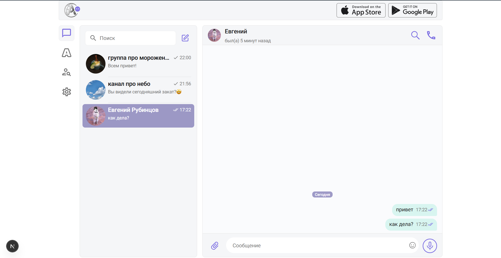
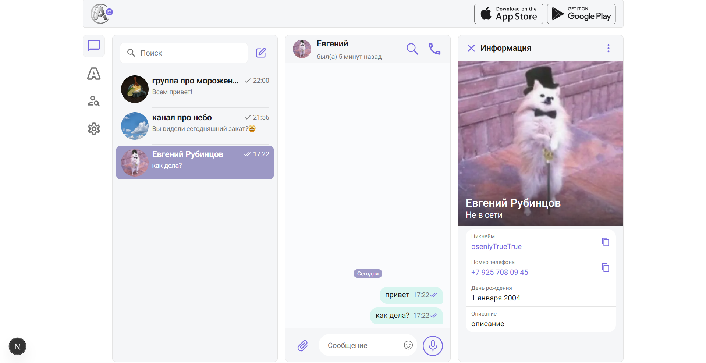
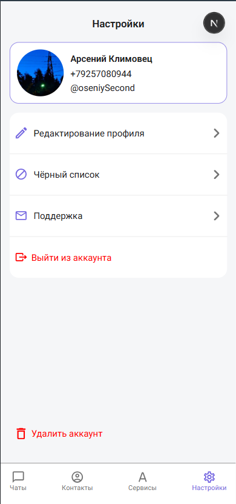
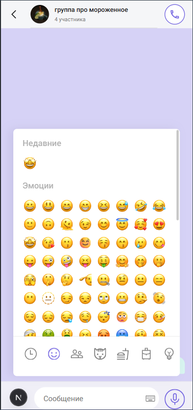
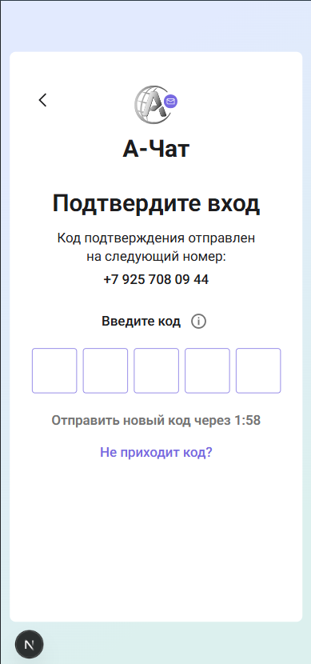

# Веб-мессенджер А-Чат

## Основная функциональность

### Коммуникация

- **Приватные чаты** — безопасный обмен личными сообщениями
- **Групповые чаты и каналы** — создание и управление коллективными беседами
- **Работа с контактами** — удобное управление списком контактов
- **Черный список** — блокировка нежелательных пользователей

### Сообщения

- **Отправка и получение сообщений** в режиме реального времени
- **Emoji picker** с поддержкой недавно использованных эмодзи
- **Медиа-сообщения** — отправка изображений и других файлов
- **Удаление и очистка сообщений** с гибкими настройками

### Пользователи и профили

- **Аутентификация по номеру телефона** с подтверждением кода
- **Настройка профиля** — имя, фото, дата рождения
- **Просмотр профилей других пользователей**
- **Информация о статусе** — был(а) в сети, онлайн

### Дополнительные возможности

- **Поддержка пользователей** — встроенная форма обратной связи
- **Адаптивный дизайн** — корректная работа на мобильных устройствах и десктопе

---

## Технические преимущества

### Современный технологический стек

**Frontend Framework**

- **Next.js 16** с использованием **Parallel Routes** для гибкого управления интерфейсом (sidebar/extra слоты)
- **React 19**
- **TypeScript 5**

**UI & Styling**

- **Tailwind CSS 4**
- **Radix UI**
- **Lucide Icons**

**State Management & Data Fetching**

- **Zustand**
- **TanStack React Query**
- **Axios** с автоматическим обновлением JWT токенов

**Forms & Validation**

- **React Hook Form**
- **Zod**
- **@hookform/resolvers**

**Безопасность**

- **JWT аутентификация** — двухтокенная система (access + refresh) с автоматическим обновлением

### Архитектура Feature-Sliced Design

Проект использует методологию **Feature-Sliced Design (FSD)** — современный подход к архитектуре фронтенд-приложений:

```
src/
├── app/          # Роутинг Next.js, страницы приложения
├── widgets/      # Самостоятельные части страниц (чат, профиль)
├── features/     # Функциональные возможности (авторизация, отправка сообщений)
├── entities/     # Бизнес-сущности (чат, пользователь, контакт)
└── shared/       # Переиспользуемые компоненты, утилиты, UI-kit
```

**Преимущества FSD:**

- Явное разделение ответственности между слоями
- Высокая переиспользуемость кода
- Легкость масштабирования и поддержки
- Предсказуемая структура для новых разработчиков

### Качество кода

**Автоматизация качества**

- **ESLint** — статический анализ кода с настроенными правилами
- **Prettier** — автоматическое форматирование кода
- **Husky** — pre-commit и pre-push hooks
- **lint-staged** — проверка только изменённых файлов

**Код-стайл**

- Только стрелочные функции (кроме Server Actions)
- Автоматическая сортировка импортов
- Автоматическая сортировка Tailwind классов
- Строгий naming convention (PascalCase для компонентов, camelCase для переменных)
- Запрет неиспользуемых переменных и console.log

**CI/CD готовность**

- Pre-push hooks запускают линтинг и сборку проекта
- Гарантия отсутствия ошибок при деплое

### Developer Experience

- **Абсолютные импорты** — `@/` и `@icons/` для удобной навигации
- **Полная типизация** — TypeScript во всём проекте

---

## Скриншоты

### Личный чат



### Профиль собеседника



### Добавление в контакты


### Настройки (мобильная версия)



### Чат (мобильная версия)



### Авторизация (мобильная версия)



---

## Установка и запуск

### Требования

- Node.js 20+
- npm или pnpm

### Установка зависимостей

```bash
npm install
```

### Настройка переменных окружения

Создайте файл `.env` в корне проекта:

```env
# Добавьте необходимые переменные окружения
```

### Запуск в режиме разработки

```bash
npm run dev
```

Приложение будет доступно по адресу [http://localhost:3000](http://localhost:3000)

### Запуск в локальной сети (для мобильного тестирования)

```bash
npm run mob
```

### Сборка для продакшена

```bash
npm run build
npm start
```

---

## Разработка

### Доступные команды

| Команда            | Описание                                 |
| ------------------ | ---------------------------------------- |
| `npm run dev`      | Запуск проекта в режиме разработки       |
| `npm run mob`      | Запуск в локальной сети                  |
| `npm run build`    | Сборка проекта для продакшена            |
| `npm run start`    | Запуск собранного проекта                |
| `npm run lint`     | Проверка кода с помощью ESLint           |
| `npm run lint:fix` | Автоматическое исправление ошибок ESLint |
| `npm run format`   | Форматирование кода с помощью Prettier   |
| `npm run check`    | Полная проверка (ESLint + Prettier)      |
| `npm run fix`      | Полная автофиксация (ESLint + Prettier)  |
| `npm run clean`    | Очистка кэша Next.js                     |

### Правила разработки

Перед началом разработки обязательно ознакомьтесь с файлом [frontend_code_rules.md](./frontend_code_rules.md), который содержит:

- Детальное описание код-стайла
- Конфигурацию инструментов (ESLint, Prettier, Husky)
- Структуру проекта
- Правила именования и архитектурные соглашения

### Git hooks

В проекте настроены автоматические проверки:

- **Pre-commit** — форматирование изменённых файлов
- **Pre-push** — полный линтинг и сборка проекта

Это гарантирует, что в репозиторий не попадёт код с ошибками.

---

## Структура проекта

```

├── app/                  # Next.js App Router
│   ├── (chat)/          # Группа роутов чата
│   ├── auth/            # Страницы аутентификации
│   └── api/             # API роуты
├── src/
│   ├── widgets/         # Составные части интерфейса
│   ├── features/        # Функциональность приложения
│   ├── entities/        # Бизнес-сущности
│   └── shared/          # Общие компоненты и утилиты
└── public/              # Статические файлы

```

---

## Технологии

<details>
<summary>Полный список используемых технологий</summary>

### Core

- Next.js 16.0.5
- React 19.2.0
- TypeScript 5.9.3

### State Management

- Zustand 5.0.8
- TanStack React Query 5.90.12

### Forms & Validation

- React Hook Form 7.67.0
- Zod 4.1.13
- @hookform/resolvers 5.2.2

### UI Components

- Radix UI (Dialog, Label, Alert Dialog, Toggle, Slot)
- Lucide React 0.555.0
- class-variance-authority 0.7.1

### Styling

- Tailwind CSS 4
- tailwind-merge 3.4.0
- prettier-plugin-tailwindcss 0.7.2

### Utils

- Axios 1.13.2
- date-fns 4.1.0
- uuid 13.0.0
- clsx 2.1.1

### Development Tools

- ESLint 9.39.1
- Prettier 3.7.4
- Husky 9.1.7
- lint-staged 16.2.7

</details>
